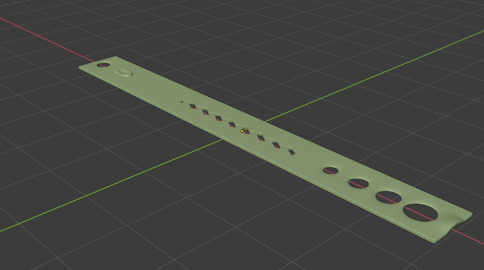
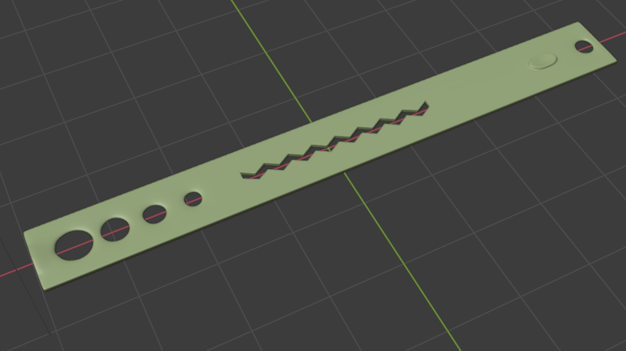

# Scale-3D-Blender
 This a simple test use of blender. Day after I learn blender.

 Here I try to replicate my scale that I bought from the store xD.

 ## Demo Video
*this can take some time to load. (Slow to start) 

## Screen shot

## 3D file
* **[Scale](https://github.com/XAbirHasan/HorrorEnviroment-Blender/blob/master/3D%20file/Monster%20and%20man.fbx)**

## Authors

* **AbirHasan**

Check out my other works [@XAbirHasan](https://github.com/XAbirHasan)
